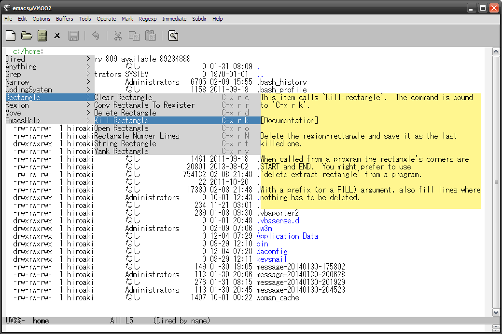

これは何？
==========

一般的なアプリケーションで右クリックすると表示される  
コンテキストメニューのようなメニューを提供するEmacsの拡張です。  

本拡張により、頻繁には使わないようなコマンドのキーバインドを忘れても、  
簡単に見つけられ、実行できるようになるのではと思います。  


スクリーンショット
==================




インストール
============

### package.elを使う場合

2014/02/09 melpaリポジトリからインストール可能  

### el-get.elを使う場合

2014/02/08 登録申請中  

### auto-install.elを使う場合

```lisp
(auto-install-from-url "https://raw.github.com/aki2o/emacs-ctxmenu/master/ctxmenu.el")
(auto-install-from-url "https://raw.github.com/aki2o/emacs-ctxmenu/master/ctxmenu-config.el")
```

※ 下記の依存拡張もそれぞれインストールする必要があります。  

### 手動の場合

ctxmenu.el/ctxmenu-config.elをダウンロードし、load-pathの通った場所に配置して下さい。  

※ 下記の依存拡張もそれぞれインストールする必要があります。  

### 依存拡張

* popup.el ... [auto-complete.el](https://github.com/auto-complete/auto-complete)に同梱
* [log4e.el](https://github.com/aki2o/log4e)
* [yaxception.el](https://github.com/aki2o/yaxception)


設定
====

#### とりあえず

`ctxmenu:show`を任意のキーにバインドすると良いと思います。  

```lisp
(require 'ctxmenu)
(require 'ctxmenu-config)
(define-key global-map (kbd "M-@") 'ctxmenu:show)
```

#### ヘルパー関数

本拡張を利用するためには、表示するメニュー内容についての定義を  
`ctxmenu:sources`/`ctxmenu:global-sources`に設定する必要があります。  
直に設定してもらっても大丈夫ですが、めんどいので以下のヘルパー関数を用意してあります。  

* `ctxmenu-config:setup`
* `ctxmenu:add-source`

#### 標準的な定義

大抵の人が欲しいと思われるメニューをctxmenu-config.elに定義してあります。  
以下の設定により、それを有効にできます。  

```lisp
(ctxmenu-config:setup)
```

`ctxmenu-config:setup`は有効にするメニューを表すシンポルを受け取ります。  
標準的なメニューを表すシンポルは  
`(describe-variable 'ctxmenu-config:default-features)`を評価することで見ることができます.  

#### 追加的な定義

余り必要ではないと思われるメニューもctxmenu-config.elには定義してあります。  
それらのシンポルは`ctxmenu-config:extra-features`に格納してありますので、  
以下の設定を追加することで、有効にできます。  

```lisp
(ctxmenu-config:setup ctxmenu-config:extra-features)
```

#### 特定メニューの除外

もし表示したくないメニューがあれば、
それを表すシンポルを`ctxmenu-config:exclude-features`に以下のように設定して下さい。  
ただし、`ctxmenu-config:setup`の実行前に行う必要があります。  

```lisp
(setq ctxmenu-config:exclude-features '(window register))
```

#### その他

追加で欲しいメニューがあれば、`ctxmenu:add-source`を使うことで実現できます。  
使い方については、`(describe-function 'ctxmenu:add-source)`を評価するか、
ctxmenu-config.elを参照して下さい。  

また、本拡張の挙動はカスタマイズ変数の設定により変えることができます。  
詳しくは、`(customize-group "ctxmenu")`を評価して下さい。  


留意事項
========

### キャッシュ消去

メニュー内容は最初に生成された後、同じモードのバッファで再利用されます。  
もしメニュー定義を変更した場合には、`ctxmenu:clear-cache`を実行すれば次回反映されます。  

### メニュー表示位置

デフォルトでは、メニューはカレントウィンドウの左上に表示されます。  
`ctxmenu:show-at-pointed`をnon-nilに設定することで、現在のカーソル位置に表示するようにできますが、  
その場合、メニュー表示が崩れたり、ヘルプが見えなくなるかもしれません。  

### ctxmenu-config:setupを使った設定

`ctxmenu-config:setup`が行う設定の中には、キーストロークからメニュー内容を生成する設定もあります。  
キーバインドをデフォルトから変更している場合、内容が正しくないメニューが表示されるかもしれません。  
その場合は、`ctxmenu-config:exclude-features`で無効にして、あなた向けの設定を追加すると良いかと思います。  


動作確認
========

* Emacs ... GNU Emacs 24.2.1 (i386-mingw-nt5.1.2600) of 2012-12-08 on GNUPACK
* popup.el ... 20140205.103
* log4e.el ... 0.2.0
* yaxception.el ... 0.1


**Enjoy!!!**

